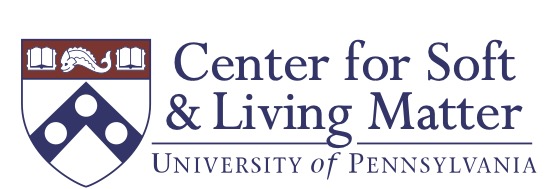

# Adventures with computational modeling and information theory: from grains to bits

<table>
  <tr>
    <td valign="top"></td>
    <td valign="top"></td>
  </tr>
 </table>

## GSNP tutorial (short course) at the [2023 APS March meeting](https://march.aps.org/)

8:00am-5:30pm on Sunday March 5, 2023  \|  Las Vegas, Nevada

## Program

The schedule and talk abstracts may be found in this [google doc](https://docs.google.com/document/d/1x4ZVKA8OtNG-2oA9J_kvN5u5JK8Zz-Ovikn9zGkRYQY/edit?usp=sharing).

**Emergent collective motion and rigidity in confluent biological tissues**

[*Lisa Manning*](https://mmanning.expressions.syr.edu/), Syracuse University

**Structural, vibrational, and mechanical properties of packings of deformable particles**

[*Corey O’Hern*](https://jamming.research.yale.edu/), Yale University

**Applications of the deformable particle model to biological systems**

[*Mark Shattuck*](https://www.ccny.cuny.edu/profiles/mark-shattuck), City College of New York (CUNY)

**How activity and deformability change the glass transition**

[*Francesco Arceri*](https://scholar.google.com/citations?user=IgIAAPgAAAAJ&hl=en), Yale University

**Bits, brains, and Boltzmann: Physics of information in living systems**

[*William Bialek*](https://phy.princeton.edu/people/william-bialek), Princeton University

**How well do neurons, humans, and artificial neural networks predict?**

[*Sarah Marzen*](https://www.sarahmarzen.com/), Claremont McKenna College

**More (species) is more different: information-rich matter in the multicomponent limit**

[*Arvind Murugan*](http://muruganlab.uchicago.edu/), University of Chicago

**Thermodynamic foundations for understanding information processing in living and artificial systems**

[*Susanne Still*](http://www2.hawaii.edu/~sstill/), University of Hawaii at Manoa

**The other side of entropy**

[*Stefano Martiniani*](https://as.nyu.edu/faculty/stefano-martiniani.html), New York University

**How machine learning is enabling an information-theoretic approach to data analysis and the design of experiments**

[*Kyle Cranmer*](http://theoryandpractice.org/), University of Wisconsin-Madison

---
## How to register

When you register for the March meeting, you have the option to add tutorial(s) to your registration.  
This short course is listed as **"GSNP Short Course on computational modeling and machine learning"**.
You have the option to register for the computational modelling portion of the program (the morning, listed as Part I), the information theory part of the program (the afternoon, listed as Part II), or both!  The price varies:

Students: $80

Early Career: $120

Regular APS members: $150

Non-APS members: $200

---
## Sponsors

We acknowledge generous support from:

<table>
  <tr>
    <td valign="top"></td>
    <td valign="top"></td>
  </tr>
 </table>

---
## Contact us

Please reach out if you have any questions:

Dong Wang, [dong.wang@yale.edu](mailto:dong.wang@yale.edu)

Kieran Murphy, [kieranm@seas.upenn.edu](mailto:kieranm@seas.upenn.edu)  

Daphne Klotsa, [dklotsa@email.unc.edu](mailto:dklotsa@email.unc.edu)

---